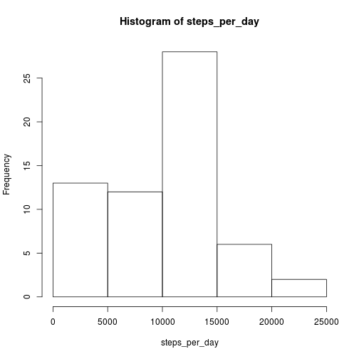

## Loading and preprocessing the data

1. Load the data


```r
data<-read.csv(file = "activity.csv")
```

2. Process/transform the data into a format suitable for the analysis

The loaded data are already in a data frame format, suitable for the analysis.

## What is mean total number of steps taken per day?

For this part of the assignment, we can ignore the missing values in the dataset.

1. Calculate the total number of steps taken per day


```r
steps_per_day <- tapply(data$steps,data$date,sum,na.rm=TRUE)
```

2. Make a histogram of the total number of steps taken each day

Here is the main difference between bar charts and histograms: with bar charts, each column represents a group defined by a categorical variable; and with histograms, each column represents a group defined by a quantitative variable.

I considered the frequency of the total steps in a day as the x-axis for the following histogram.


```r
hist(steps_per_day)
```

 

3. Calculate and report the mean and median of the total number of steps taken per day


```r
mean(steps_per_day)
```

```
## [1] 9354.23
```

```r
median(steps_per_day)
```

```
## [1] 10395
```


## What is the average daily activity pattern?

1. Make a time series plot (i.e. type = "l") of the 5-minute interval (x-axis) and the average number of steps taken, averaged across all days (y-axis)

I calculated the mean of the steps in the different time intervals across the days usinf the function tapply.

Then I plotted that means, taking as the x-axis the interval label (for example, label "1845" indicates 18 hours 45 minutes interval).


```r
mean_steps_per_interval <- tapply(data$steps,data$interval,mean,na.rm=TRUE)
plot(names(mean_steps_per_interval), mean_steps_per_interval, type = "l")
```

 

2. Which 5-minute interval, on average across all the days in the dataset, contains the maximum number of steps?

I calculated the maximum for the average steps per interval across the days, then I insulated the maximum interval and I took its name.

The results are then ilustrated as inline computations.


```r
max_average_steps <- max(mean_steps_per_interval)
max_interval<-names(mean_steps_per_interval[mean_steps_per_interval==max_average_steps])
```

The interval is 835, with an average of 206.1698113 steps

## Imputing missing values

1. Calculate and report the total number of missing values in the dataset (i.e. the total number of rows with NAs)


```r
na_values<-is.na(data$steps)
na_total<-sum(na_values)
```

The NA values are 2304.

2. Devise a strategy for filling in all of the missing values in the dataset.

I choosed the mean for that 5-minute interval (previously calculated).

3. Create a new dataset that is equal to the original dataset but with the missing data filled in.


```r
filled_data<-data
for(i in 1:length(data$steps)){
  if(na_values[i]){
    interval<-data$interval[i]
    filled_data[i,1]<-mean_steps_per_interval[as.character(interval)]
  }
}
```

4. Make a histogram of the total number of steps taken each day and Calculate and report the mean and median total number of steps taken per day. Do these values differ from the estimates from the first part of the assignment? What is the impact of imputing missing data on the estimates of the total daily number of steps?


```r
new_steps_per_day <- tapply(filled_data$steps,filled_data$date,sum)
hist(new_steps_per_day)
```

 

```r
mean(new_steps_per_day)
```

```
## [1] 10766.19
```

```r
median(new_steps_per_day)
```

```
## [1] 10766.19
```

## Are there differences in activity patterns between weekdays and weekends?

Use the dataset with the filled-in missing values for this part.

1. Create a new factor variable in the dataset with two levels – “weekday” and “weekend” indicating whether a given date is a weekday or weekend day.


```r
weekdays<-weekdays(as.Date(filled_data$date))
for(i in 1:length(filled_data$steps)){
  if(weekdays[i]=="domenica"){
    weekdays[i]<-"weekend"
  } else if(weekdays[i]=="sabato"){
    weekdays[i]<-"weekend"
  } else {
    weekdays[i]<-"weekday"
  }
}
factors<-factor(weekdays)

filled_data[,4]<-factors
names(filled_data)[4]<-"weekdays"
```

2. Make a panel plot containing a time series plot (i.e. type = "l") of the 5-minute interval (x-axis) and the average number of steps taken, averaged across all weekday days or weekend days (y-axis).


```r
weekdays_data<-filled_data[filled_data$weekdays=="weekday",]
weekends_data<-filled_data[filled_data$weekdays=="weekend",]

mean_steps_weekdays <- tapply(weekdays_data$steps,weekdays_data$interval,mean)
mean_steps_weekends <- tapply(weekends_data$steps,weekends_data$interval,mean)
par(mfrow = c(2,1))
plot(names(mean_steps_weekdays) , mean_steps_weekdays, type = "l")
plot(names(mean_steps_weekends) , mean_steps_weekends, type = "l")
```

 
